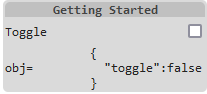
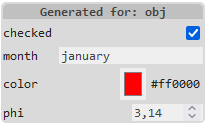
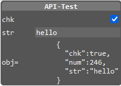

### Abstract

Many webapplications are of small to medium size. Equipping these with a pleasing user control menu usually is comparatively costly. For this purpose, presented is a simple solution concept to rapidly prototype a pleasing GUI even without programming and even automatically.

## Content

  - [1. What is It ?](#1-what-is-it)
  - [2. Getting Started](#2-getting-started)
  - [3. `<ctrl-ing>` Element](#3-ctrl-ing-element)
    - [3.1 `<ctrl-ing>` Attributes](#31-ctrl-ing-attributes)
    - [3.2 Automatical Menu Generation](#32-automatical-menu-generation)
  - [4. Sections](#4-sections)
  - [5. API](#5-api)
    - [5.1 Self-Control](#51-self-control)
  - [6. Other Controller Libraries](#6-other-controller-libraries)
  - [7. Conclusion](#7-conclusion)
  - [References](#references)


## 1. Introduction

`<ctrl-ing>` is a tiny HTML custom element used to interactively control your Web-App parameters or JavaScript/JSON/DOM object values in a comfortable way with the following characteristics:

* tiny footprint `25.3/14.2 kB` un/compressed.
* dependency free.
* easy prototypical generation with low effort. No programming required.
* an object given, a menu template can be created automatically.
* getting a pleasing GUI.

<figure style="text-align:center"> 
   
</figure>  
<figcaption style="font-size:0.95em;text-align:center">Fig. 1: Controlling an Animation.</figcaption><br>

Its interactive menu on the right side of Figure 1 was created via:

```json
<ctrl-ing ref="app" darkmode>
  [ {"sec":"hdr","text":"Parameters"},
    {"sec":"num","label":"a","min":0,"max":10,"step":1,"path":"$['a']","unit":"[-]"},
    {"sec":"num","label":"b","min":0,"max":10,"step":1,"path":"$['b']","unit":"[-]"},
    {"sec":"hdr","text":"Animation"},
    {"sec":"chk","label":"run","path":"$['run']"},
    {"sec":"rng","label":"vel","min":1,"max":10,"step":1,"path":"$['vel']"},
    {"sec":"hdr","text":"Style"},
    {"sec":"col","label":"Stroke","path":"$['ls']"},
    {"sec":"col","label":"Fill","path":"$['fs']"}
  ]
</ctrl-ing>
```
<figcaption>Listing 1: Structure of custom HTML element <code>ctrl-ing</code>.</figcaption><br>

Beside implementing your web application, all you need to do for prototyping an appealing GUI, is inserting a `<ctrl-ing>` element to your HTML document (see Listing 1). Its content is compact JSON text, representing an array of section objects. Each section corresponds to a single line in the grid-like view structure of the `<ctrl-ing>` menu and is associated to either

* *input* controlling application parameters.
* *output* monitoring values.
* *structuring* elements.


All section objects are generated using plain native HTML (form) elements in the background (shadow DOM) [[3]](#3). That markup is hidden and separated from other code on the page, thus avoiding code collisions.

Source code and complete documentation on the web containing an interactive reference is available [[1,2]](#1).

## 2. Getting Started

We might want to start with a minimal example and create this controlling menu.

<figure style="text-align:center"> 
   
</figure>  
<figcaption style="font-size:0.95em;text-align:center">Fig. 2: Minimal <code>&lt;ctrl-ing&gt;</code> Example.</figcaption><br>

Here is the complete HTML page.

```html
<!doctype html>
<html>
<head>
    <meta charset='utf-8'>
    <title>Getting Started</title>
    <script src="https://cdn.jsdelivr.net/npm/ctrling/ctrling.min.js"></script>
</head>
<body>
    <ctrl-ing ref="obj" autoupdate>
        [ {"sec":"hdr","text":"Getting Started"},
          {"sec":"chk","label":"Toggle","path":"$['toggle']"},
          {"sec":"out","label":"obj=","path":"$"}
        ]
    </ctrl-ing>
    <script>
        const obj = {
            toggle: false
        }
    </script>
</body>
</html>
```
<figcaption>Listing 2: Minimalistic example using <code>&lt;ctrl-ing&gt;</code> element.</figcaption><br>

With this example please take note of following points:

* By its `ref="obj"` attribute the `<ctrl-ing>` instance references a global object `obj`.
* The `chk` section in the JSON content accesses the `toggle` member of the reference object `obj` via its `path` property using standard [JSONPath](https://ietf-wg-jsonpath.github.io/draft-ietf-jsonpath-base/draft-ietf-jsonpath-base.html#name-normalized-paths) syntax, where the root identifier `"$"` corresponds to the `ref` attribute content above.
* The `out` section is monitoring the reference object in JSON text format.
* The `autoupdate` attribute of the `<ctrl-ing>` instance enables monitoring sections to be updated automatically. 
* `ctrling.js` is inserted via CDN to the page.

<br><br><br>

The generated encapsulated shadow DOM structure for the `<ctrl-ing>` element in this example is quite clear.

```html
<main>
    <section class="hdr">Getting Started</section>
    <section class="chk">
        <label>Toggle<input type="checkbox"></label>
    </section>
    <section class="out">
        obj=<span><output>{
          "toggle":false
        }</output></span>
    </section>
</main>
```
<figcaption>Listing 3: Internal DOM structure of the <code>ctrl-ing</code> element.</figcaption><br>

## 3. `<ctrl-ing>` Element

The default width of the `<ctrl-ing>` menu is `200px`, which can be modified by the element's `width` attribute. Its default position is the top right corner of its parent element's area. This might be fine-adjusted via `top` and `right` attributes.

We can use multiple `<ctrl-ing>`s per page &ndash; always right aligned each. In this case the elements should be encapsulated via 

```html
<div style="position:relative;">
    <ctrl-ing>...</ctrl-ing>
</div>
```

If the `<ctrl-ing>` element should be positioned side-by-side with another (to be controlled) element &ndash; which is frequently the case, the following markup might be used

```html
<div style="display:flex; position:relative;">
    <div>...</div>
    <ctrl-ing>...</ctrl-ing>
</div>
```

The connection from the `<ctrl-ing>` element and its content to application parameter values is established via element attributes and section members representing paths pointing into an application object. These path strings MUST start with one of

* `globalThis` or `window`
* the root identifier `$`, referencing an application object name indicated by the `<ctrl-ing>` element's `ref` attribute.

Thus the reference object MUST be an object (JavaScript arrays are objects).

The rest of the path string MUST obey the syntax of *Normalized Paths* according to [Internet standard *JSONPath*](https://ietf-wg-jsonpath.github.io/draft-ietf-jsonpath-base/draft-ietf-jsonpath-base.html#name-normalized-paths) (IETF), i.e.

* using the bracket syntax `[...]` exclusively.
* enclosing member names in single quotation marks.

### 3.1 `<ctrl-ing>` Attributes

For an `<ctrl-ing>` element following optional attributes are supported:

| Attribute | Default | Meaning |
|:--:|:--:|:--|
|`ref`  | `window` | Referencing a global object variable of the name indicated by this attribute.  |
|`width`  | `200px` | Width of the GUI menu.  |
|`top`  | `0` | Distance relative to top edge of parent element. |
|`right`  | `0` | Distance relative to right edge of parent element. |
|`darkmode`  | - | Display GUI menu in dark mode (default: light). |
|`autoupdate`  | - | Automatically update monitoring and input sections. |
|`autogenerate`  | - | Automatically generate a prototype menu from the object given by `ref` attribute. |
|`tickspersecond`  | `4` | How often to update sections per second (on external value change). |
|`callback`  | - | If present, will be called with each user value change by input sections. The attribute value must obey the [JSONPath](https://ietf-wg-jsonpath.github.io/draft-ietf-jsonpath-base/draft-ietf-jsonpath-base.html#name-normalized-paths) syntax rules and might be a global function or an object method. |

<figcaption>Table 1: Supported <code>ctrl-ing</code> attributes.</figcaption><br>

The `callback` function or method will be handed over an argument object with the structure:

```js
args = {
    ctrl,    // current `<ctrl-ing>` element object.
    obj,     // parent object holding the member, whose value is to be set.
    member,  // the member name, whose value is to be set.
    value,   // the new member value.
    section, // the current section object.
    elem     // the current html <section> element.
}
```
Please note, that a first initial call of the `callback` function &ndash; when exists &ndash; is automatically done during initialization time. A reduced object `args = {ctrl}` will be passed as an argument then.

### 3.2 Automatical Menu Generation

It is possible to let a `<ctrl-ing>` element automatically generate a GUI menu from a given JavaScript object.

```html
<ctrl-ing ref="gen" autogenerate></ctrl-ing>
```

<div style="display:flex; justify-content:space-between; position:relative; font-size:0.8em;">

```js
const gen = {
    checked: true,
    _priv: false,
    month: "january",
    number: 42,
    color: '#ff0000',
    get phi() { return this._phi || 3.14; },
    set phi(q) { return this._phi = q; }
}
```


</div>

Automatical menu generation with `<ctrl-ing>` works according to following rules.

* its `ref` attribute must point to a valid object.
* its `autogenerate` attribute must be present.
* the object's properties delivered by [`Object.getOwnPropertyNames()`](https://developer.mozilla.org/en-US/docs/Web/JavaScript/Reference/Global_Objects/Object/getOwnPropertyNames) are taken to build the menu.
  * the member value types `boolean`, `number` and `string` create sections of type `chk`, `num` and `txt`.
  * a member value type of `string` whose value starts with `"#"` is assumed to represent a rgb color value and generates a section of type `col`.
  * members with type of `object` are not taken into account.
  * getters/setters are treated as normal properties.
  * property names starting with underline `"_"` are considered private and skipped.
* an `autogenerate="source"` attribute generates an additional final section of type `out` containing the JSON text of the generated sections as a template for further use.


## 4. Sections

For each section in the JSON content of the `<ctrl-ing>` element there is a HTML `<section>` element containing either plain visually structuring, data monitoring or interactive form elements. Here is an overview of the twelve different section types. 

| Type | HTML (shadow) | Task |
|:--:|:--|:--|
|[`btn`](#41-button)  | `<button>` | Perform an action by calling a parameterless function or object method.  |
|[`chk`](#42-checkbox)  | `<input type="checkbox">` | Display a checkbox for entering Boolean parameter values. |
|[`col`](#43-color)  | `<input type="color">` | Display a color menu for setting an RGB color parameter value. |
|[`hdr`](#44-header)  | text string | Header for menu structuring. |
|[`mtr`](#45-meter)  | `<meter>` | Graphically monitoring a numerical value in a range. |
|[`num`](#46-number)  | `<input type="number">` | Display an input field for entering a numerical parameter value. |
|[`out`](#47-output)  | `<output>` | Monitoring any data. |
|[`rng`](#48-range)  | `<input type="range">` | Display a slider element for setting a numerical parameter value. |
|[`sel`](#49-selection)  | `<select>` | Provides a drop down menu of options. |
|[`sep`](#410-separator)  | `<hr>` | Display a separating line for menu structuring. |
|[`txt`](#411-text)  | `<input type="text">` | Display an input field for entering a textual parameter value. |
|[`vec`](#412-vector)  | multiple<br>`<input type="text">` | Display a set of input fields for entering multiple related data values. |

<figcaption>Table 2: Available section types.</figcaption><br>

See the interactive Section reference [https://goessner.github.io/ctrling/#4-sections-reference](https://goessner.github.io/ctrling/#4-sections-reference).

## 5. API

The `<ctrl-ing>` menu internals are hidden behind the shadow DOM. For offering programmatical access to these internals, an API supporting method-chaining is provided. Here is an example script how to use it.

<figure style="text-align:center"> 
  
</figure>  

<figcaption>Fig.3 : Control menu resulting from API calls.</figcaption><br>

```html
<ctrl-ing id="ctrl"></ctrl-ing>
<script>
  const obj = {
    chk: true,
    num: 246,
    str: 'hello'
  }

  document.getElementById('ctrl').oninit((ctrl) => {                        // (1)
    ctrl.setAttr('ref', 'obj')                                              // (2)
        .setAttr('darkmode')
        .setAttr('autoupdate')
        .addSection({"sec":"hdr","text":"API-Test"})                        // (3)
        .addSection({"sec":"chk","label":"chk","path":"$['chok']"})         // (4)
        .addSection({"sec":"num","label":"num","path":"$['num']"})
        .addSection({"sec":"out","label":"obj=","path":"$"})
        .insertSection(3, {"sec":"txt","label":"str","path":"$['str']"})    // (5)
        .updateSection(1, {"sec":"chk","label":"chk","path":"$['chk']"})    // (6)
        .removeSection(2)                                                   // (7)
  })
</script>
```
<figcaption>Listing 4: Control menu generation and modification via API calls.</figcaption><br>


Comments to the line numbers:

1. Ensure to start with API calls when the `<ctrl-ing>` element is completely initialized.
2. The `setAttr` method is merely syntactic sugar for the native `setAttribute` method. It additionally supports chaining of method calls only.
3. `addSection` methods are used to sequentially build the control menu. They get a single object literal argument representing a section.
4. Note the intentional typo with the `path` value. That will be corrected in (6).
5. `insertSection` method inserts a new section before section with current index `3`, i.e. `{"sec":"out",...}`.
6. `updateSection` method corrects the typo in line (4) and updates section with current index `1`, i.e. `{"sec":"chk",...}`.
7. `removeSection` method removes the section with current index `2`, i.e. `{"sec":"num",...}`.

The API works properly at the earliest after the `<ctrl-ing>` element is completely initialized. In order to ensure this, we want to encapsulate the API method calls in a callback function oninit((ctrl) => { ... }). The callback function receives the `<ctrl-ing>` element object as a single argument.

<br>

| Method | Returns | Comment |
|:--|:--|:--|
|`addSection(sec)` | `this` | Append a new section object `sec` to the sections array.  |
|`findSectionIndex(fn)` | index | Locate the first section in the sections array, that fulfills the condition given by function `fn`. Returns the array index found or `-1` on failure. The condition function receives the current section during iteration as argument. |
|`insertSection(idx,sec)` | `this` | Insert a new section object `sec` to the sections array before the section at index `idx`.  |
|`oninit(fn)` | - | Invoking a callback function `fn`, while ensuring that the control menu object is completely initialized. The callback function receives the `<ctrl-ing>` element object as a single argument. |
|`removeAttr(attr)` | `this` | Remove `<ctrl-ing>`'s attribute `attr`.  |
|`removeSection(idx)` | `this` | Remove the section at index `idx`. |
|`setAttr(attr,value)` | `this` | Set `<ctrl-ing>`'s attribute `attr` to value `value`.  |
|`section(idx)` | section | Select a section from the sections array by index `idx`.  |
|`updateControlValues()` | `this` | When the `autoupdate` attribute is not set, this method might be used programmatically to update current values in the control elements instead. |
|`updateSection(idx,sec)` | `this` | If `sec` is present, current section at index `idx` will be replaced by `sec`, otherwise current section is assumed to be modified and stays in place. The shadow DOM is getting updated hereafter. |

<figcaption>Table 3: API Methods.</figcaption><br>

### 5.1 Self-Control

API methods may be used to modify the `<ctrl-ing>` menu itself. Here is an example, how to disable the section with index `2`.


```json
<ctrl-ing ref="objslf" callback="$['callbk']">
  [ {"sec":"hdr","text":"Self-Control"},
    {"sec":"chk","label":"Disable str","path":"$['disable']"},
    {"sec":"txt","label":"str","path":"$['str']"}
  ]
</ctrl-ing>
```

<div style="display:flex; position:relative; font-size:0.8em;">

```js
const objslf = {
    disable: false,
    str: "Hello",
    callbk({ctrl, obj, member, value, section, elem}) {
        if (member === 'disable') {
            ctrl.section(2).disabled = value;
            ctrl.updateSection(2);
        }
    }
}
```
  
</div>

## 6. Other Controller Libraries

There are a couple of JavaScript controller libraries. Here are two overview pages [[4, 5]](#4). From the controller libraries listed there `dat.gui` is the most mature and most popular one. Many of the other libraries are kind of `dat.gui` clones providing an identical or very similar API. Some of them have very powerful features added like enhanced color pickers and/or charting capabilities. If you want a `dat.gui` like JavaScript solution, it is recommended to take one of these controller libraries.

`<ctr-ing>` has a different, more minimalistic approach with quickly prototyping a GUI menu by using markup/JSON alone. It deliberately uses plain standard HTML form elements for user interaction despite some of their known deficiencies. Hence the advantage of its light weight, which is considerable smaller (25 kB uncompressed) than the libraries above.


## 7. Conclusion

`<ctrl-ing>` is a lightweight HTML custom element. It helps to rapidly prototype a pleasing GUI without programming. Web-App parameters or JavaScript/JSON/DOM object values can be monitored or interactively modified.

A `<ctrl-ing>` menu can be built with few HTML/JSON text alone. Accessing its HTML element via JavaScript can be done via well known DOM methods. Accessing the hidden shadow DOM sections is not possible though. For enabling programmatical access to the internal menu structure, a small API is provided.

`<ctrl-ing>` does not depend on other libraries and is meant as a helper for webapplications of small to medium size.

<br>

## References 
<span id="1">[1] &lt;ctrl-ing&gt; - A Smart GUI Controller, [https://goessner.github.io/ctrling/](https://goessner.github.io/ctrling/)</span>    
<span id="2">[2] &lt;ctrl-ing&gt; Github Repository, [https://github.com/goessner/ctrling](https://github.com/goessner/ctrling)</span>    
<span id="3">[3] HTML input types,<br>&nbsp;&nbsp;&nbsp;&nbsp;&nbsp; [https://developer.mozilla.org/en-US/docs/Web/HTML/Element/Input#input_types](https://developer.mozilla.org/en-US/docs/Web/HTML/Element/Input#input_types)</span>    
<span id="4">[4] List of JavaScript GUI Control libraries, [https://xosh.org/javascript-control-ui/](https://xosh.org/javascript-control-ui/)</span>    
<span id="5">[5] JavaScript GUI libraries,<br>&nbsp;&nbsp;&nbsp;&nbsp;&nbsp;
[https://gist.github.com/SMUsamaShah/71d5ac6849cdc0bffff4c19329e9d0bb](https://gist.github.com/SMUsamaShah/71d5ac6849cdc0bffff4c19329e9d0bb)</span>    
