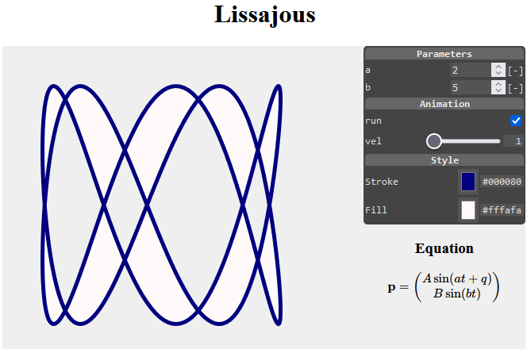
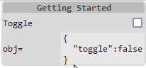

# `ctrling`

## What is it ... ?

`ctrl-ing` is a tiny HTML custom element (18.4 kB uncompressed) used to interactively control your Web-App parameters or JavaScript/JSON object values in a comfortable way with a pleasing GUI [[1]](#1).

<figure style="text-align:center"> 
   
</figure>  
<figcaption style="font-size:0.95em;text-align:center">Fig. 1: Controlling an Animation.</figcaption><br><br>

The interactive menu for this example was created via:

```html
<ctrl-ing ref="app" darkmode>
  [ {"sec":"hdr","text":"Parameters"},
    {"sec":"num","label":"a","min":0,"max":10,"step":1,"path":"$['a']","unit":"[-]"},
    {"sec":"num","label":"b","min":0,"max":10,"step":1,"path":"$['b']","unit":"[-]"},
    {"sec":"hdr","text":"Animation"},
    {"sec":"chk","label":"run","path":"$['run']"},
    {"sec":"rng","label":"vel","min":1,"max":10,"step":1,"path":"$['vel']"},
    {"sec":"hdr","text":"Style"},
    {"sec":"col","label":"Stroke","path":"$['ls']"},
    {"sec":"col","label":"Fill","path":"$['fs']"}
  ]
</ctrl-ing>
```
<figcaption>Listing 1: Structure of custom HTML element <code>ctrl-ing</code>.</figcaption><br><br>

Beside implementing your web application, all you need to do for creating an appealing GUI, is inserting a `<ctrl-ing>` element to your HTML document (see Listing 1). Its content is compact JSON text, representing an array of section objects. Each section corresponds to a single line in the grid-like view structure of the `<ctrl-ing>` element's shadow DOM and is associated to either

* *input* controlling application parameters.
* *output* monitoring values.
* *structuring* elements.

All section objects are generating plain native HTML (form) elements in the background (shadow DOM). 

## 2. Getting Started

Let's start with a minimal example resulting in this controlling menu.

<figure style="text-align:center"> 
   
</figure>  
<figcaption style="font-size:0.95em;text-align:center">Fig. 2: Minimal <code>&lt;ctrl-ing&gt;</code> Example.</figcaption><br><br>

Here is the complete HTML code.

```html
<!doctype html>
<html>
<head>
    <meta charset='utf-8'>
    <title>Getting Started</title>
    <script src="https://cdn.jsdelivr.net/npm/ctrling/ctrling.min.js"></script>
</head>
<body>
    <ctrl-ing ref="obj" autoupdate>
        [ {"sec":"hdr","text":"Getting Started"},
          {"sec":"chk","label":"Toggle","path":"$['toggle']"},
          {"sec":"out","label":"obj=","path":"$"}
        ]
    </ctrl-ing>
    <script>
        const obj = {
            toggle: false
        }
    </script>
    </body>
</html>
```
<figcaption>Listing 2: Minimalistic example using <code>&lt;ctrl-ing&gt;</code> element.</figcaption><br><br>

With this example please take note of following points:

* By its `ref="obj"` attribute the `<ctrl-ing>` instance references a global object `obj`.
* The `chk` section in the JSON content accesses the `toggle` member of the reference object `obj` via its `path` property using standard [JSONPath](https://ietf-wg-jsonpath.github.io/draft-ietf-jsonpath-base/draft-ietf-jsonpath-base.html#name-normalized-paths) syntax, where the root identifier `"$"` corresponds to the `ref` attribute above.
* The `out` section is monitoring the reference object in JSON text format.
* The `autoupdate` attribute of the `<ctrl-ing>` instance enables monitoring sections to be updated automatically. 
* `ctrling.js` is inserted via CDN to the page.

The generated encapsulated shadow DOM structure for this example is quite clear.

```html
<main>
    <section class="hdr">Getting Started</section>
    <section class="chk">
        <label>Toggle<input type="checkbox"></label>
    </section>
    <section class="out">
        obj=<span><output>{
          "toggle":false
        }</output></span>
    </section>
</main>
```

## CDN

Use a local instance or following CDN link for `ctrling.js`.
* `https://cdn.jsdelivr.net/npm/ctrling/ctrling.js`
* `https://cdn.jsdelivr.net/npm/ctrling/ctrling.min.js`

## Changelog

###  [0.8.1] on December 20, 2022
* First published.

## License

`ctrling` is licensed under the [MIT License](http://opensource.org/licenses/MIT)

 © [Stefan Gössner](https://github.com/goessner)
