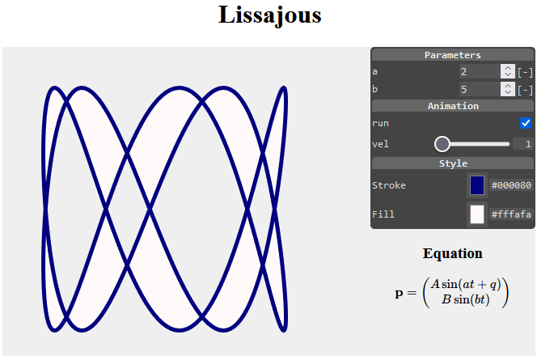

[](https://www.jsdelivr.com/package/npm/ctrling)
# &lt;ctrl-ing&gt; - A Smart GUI Controller

## What is it ... ?

`<ctrl-ing>` is a tiny HTML custom element used to interactively control your Web-App parameters or JavaScript/JSON/DOM object values in a comfortable way with the following characteristics:

* tiny footprint `25.3/14.2 kB` un/compressed.
* dependency free.
* easy prototypical generation with low effort. No programming required.
* an object given, a menu template can be created automatically.
* getting a pleasing GUI.

<br>

<figure style="text-align:center"> 
   
</figure>  
<figcaption style="font-size:0.95em;text-align:center">Fig.: Controlling an Animation.</figcaption><br>

The interactive menu on the right side of Figure 1 was created via:

```json
<ctrl-ing ref="app" darkmode>
  [ {"sec":"hdr","text":"Parameters"},
    {"sec":"num","label":"a","min":0,"max":10,"step":1,"path":"$['a']","unit":"[-]"},
    {"sec":"num","label":"b","min":0,"max":10,"step":1,"path":"$['b']","unit":"[-]"},
    {"sec":"hdr","text":"Animation"},
    {"sec":"chk","label":"run","path":"$['run']"},
    {"sec":"rng","label":"vel","min":1,"max":10,"step":1,"path":"$['vel']"},
    {"sec":"hdr","text":"Style"},
    {"sec":"col","label":"Stroke","path":"$['ls']"},
    {"sec":"col","label":"Fill","path":"$['fs']"}
  ]
</ctrl-ing>
```
<figcaption>Listing: Structure of custom HTML element <code>ctrl-ing</code>.</figcaption><br><br>

Beside implementing your web application, all you need to do for prototyping an appealing GUI, is inserting a `<ctrl-ing>` element to your HTML document (see Listing 1). Its content is compact JSON text, representing an array of section objects. Each section corresponds to a single line in the grid-like view structure of the `<ctrl-ing>` menu and is associated to either

* *input* controlling application parameters.
* *output* monitoring values.
* *structuring* elements.

All section objects are generating plain native HTML (form) elements in the background (shadow DOM). That markup is hidden and separated from other code on the page &mdash; thus avoiding code collisions.

Help for getting started and a complete documentation containing an interactive reference [is available](https://goessner.github.io/ctrling/).

## Examples

| Run | Source | Example |
|:--|:--|:--|
|[API](https://goessner.github.io/ctrling/examples/ctrl-api.html) | [source](https://github.com/goessner/ctrling/docs/examples/ctrl-api.html) | Using the API |
|[array](https://goessner.github.io/ctrling/examples/ctrl-array.html) | [source](https://github.com/goessner/ctrling/docs/examples/ctrl-array.html) | Controlling an array object |
|[autogenerate](https://goessner.github.io/ctrling/examples/ctrl-autogenerate.html) | [source](https://github.com/goessner/ctrling/docs/examples/ctrl-autogenerate.html) | Automatically generating a menu |
|[color](https://goessner.github.io/ctrling/examples/ctrl-color.html) | [source](https://github.com/goessner/ctrling/docs/examples/ctrl-color.html) | Controlling an RGB color |
|[demo](https://goessner.github.io/ctrling/examples/ctrl-demo.html) | [source](https://github.com/goessner/ctrling/docs/examples/ctrl-demo.html) | Showing all features |
|[lissajous](https://goessner.github.io/ctrling/examples/ctrl-lissajous.html) | [source](https://github.com/goessner/ctrling/docs/examples/ctrl-lissajous.html) | Lissajous App |
|[minimal](https://goessner.github.io/ctrling/examples/ctrl-minimal.html) | [source](https://github.com/goessner/ctrling/docs/examples/ctrl-minimal.html) | Minimal menu generation |
|[parse-error](https://goessner.github.io/ctrling/examples/ctrl-parse-error.html) | [source](https://github.com/goessner/ctrling/docs/examples/ctrl-parse-error.html) | Treating JSON parse error |
|[paths](https://goessner.github.io/ctrling/examples/ctrl-paths.html) | [source](https://github.com/goessner/ctrling/docs/examples/ctrl-paths.html) | Using paths as JSONPath strings |
|[self](https://goessner.github.io/ctrling/examples/ctrl-self.html) | [source](https://github.com/goessner/ctrling/docs/examples/ctrl-self.html) | Controlling the menu itself |
|[svg](https://goessner.github.io/ctrling/examples/ctrl-svg.html) | [source](https://github.com/goessner/ctrling/docs/examples/ctrl-svg.html) | Controlling SVG graphics |
|[todeg](https://goessner.github.io/ctrling/examples/ctrl-todeg.html) | [source](https://github.com/goessner/ctrling/docs/examples/ctrl-todeg.html) | Transform property with user setting |
|[variable](https://goessner.github.io/ctrling/examples/ctrl-variable.html) | [source](https://github.com/goessner/ctrling/docs/examples/ctrl-variable.html) | Controlling a single variable value |
|[vector](https://goessner.github.io/ctrling/examples/ctrl-vector.html) | [source](https://github.com/goessner/ctrling/docs/examples/ctrl-vector.html) | Controlling multiple values as vector |
<figcaption style="font-size:0.95em;text-align:center">Table: Controlling an Animation.</figcaption><br>

## CDN

Use a local instance or one of the following CDN links for `ctrling.js`.
* `https://cdn.jsdelivr.net/npm/ctrling/ctrling.js`
* `https://cdn.jsdelivr.net/npm/ctrling/ctrling.min.js`

## FAQ

* __Can I control a single global variable ?__
  * In short ... yes.
  * You only need to declare it using `var`, since `let` and `const` variables aren't accessible using `globalThis` or `window` object, which is used here for global variables. No restriction for objects or arrays though.
  * See [`ctrl-variable.html`](./examples/ctrl-variable.html) for an example.
* __Can I control an array ?__
  * Yes, see [`ctrl-array.html`](./examples/ctrl-array.html) for an example.
* __Can I convert values while setting ?__
  * Yes.
  * Either use getter/setter pair for get/set value ...
  * ... or use `callback` function for setting value only.
  * See [`ctrl-todeg.html`](./examples/ctrl-todeg.html) for an example.
* __Can you implement feature X and possibly feature Y ?__
  * `ctrling` serves my personal needs very well as it is.
  * So ... no, I won't.
  * Please go ahead and implement it by yourself.
  * If you think, your enhancement is of common interest, you are very welcome, to send me a pull request.

## Changelog

###  [0.8.1] on December 20, 2022
* First published.
###  [0.8.23] on January 11, 2023
* Feature complete.

## License

`ctrling` is licensed under the [MIT License](http://opensource.org/licenses/MIT)

 © [Stefan Gössner](https://github.com/goessner)
